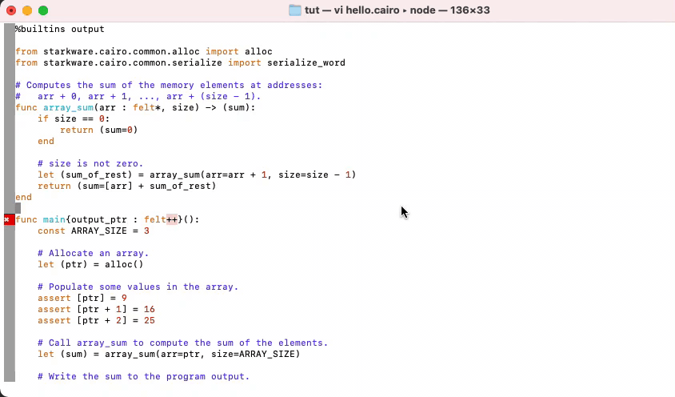

# Vim Cairo

⚠️⚠️ **THIS REPOSITORY IS DEPRECATED.  SEE https://github.com/ericglau/cairo-ls/blob/main/VIM.md INSTEAD.** ⚠️⚠️

---

Language Support for [Cairo](https://www.cairo-lang.org/) in Vim.  

Makes use of the [Cairo language server](https://github.com/ericglau/cairo-ls) and [LanguageClient-neovim](https://github.com/autozimu/LanguageClient-neovim).

**Note**: This is an early preview and is still in active development.

Tested on Mac OS. Probably works on Linux.

## Installation

Git clone this repo and run `./install-vim-cairo.sh`

Or if you are familiar with Vim and LSP, review the scripts and manually configure your preferred language client to use the Cairo language server which can be found by unzipping the VS Code extension's .vsix file.

## Usage

- Compile errors: automatically highlighted
- Go To Definition: put cursor over a function or imported module, then press F2 to go to its definition
- Quick Fix: put cursor over a compile error and press F3, then choose a suggested quick fix
- Hover: put cursor over a Cairo statement and press F4 to view more information (minimal support for now)

